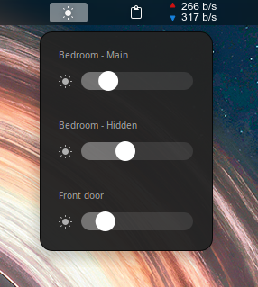
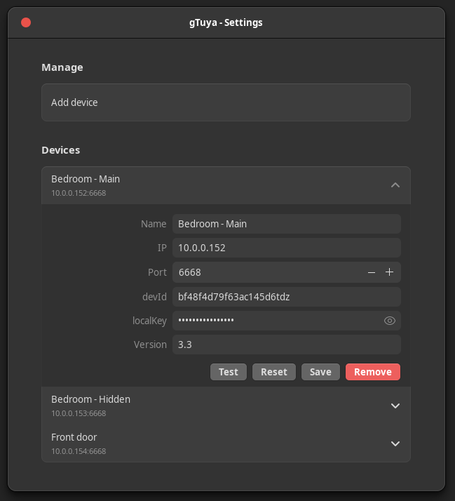

# gTuya

Local-only **Tuya LED** power & brightness control for **GNOME Shell**  right from your top bar.  
_No cloud needed. Just click, slide, done._




---

## Features

- Multiple devices (add / edit / remove) via a native **libadwaita** settings window
- Top-bar menu with one row per device
  - Small brightness icon toggles **On/Off**
  - Smooth brightness slider (**0–1000**). `0` → Off, `>0` → On + Brightness
- **Right-click** the top-bar icon to open **Settings**
- Queries each device on startup to initialize UI
- Debounced brightness updates (1s) to avoid packet floods
- 100% local LAN control over TCP (no Tuya cloud)

---

## 🧩 Requirements

- GNOME Shell **45 / 46 / 47**
- **OpenSSL** at `/usr/bin/openssl`
- Your lamp’s **IP**, **devId**, and **localKey** (exactly **16** ASCII chars) (tutorial: https://www.youtube.com/watch?v=YKvGYXw-_cE)
- Network access from your desktop to the device(s)

---

## 📦 Install

Clone into the user extensions dir:

```bash
git clone https://github.com/yourname/gTuya.git \
  ~/.local/share/gnome-shell/extensions/tuya-toggle@kostas
